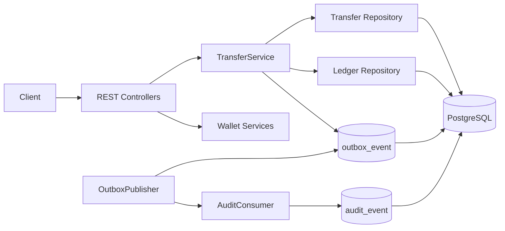
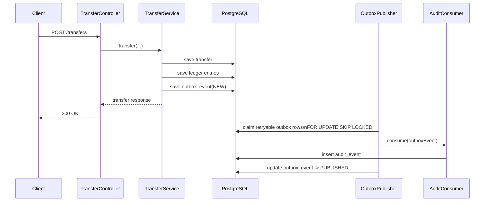

# SafeTransfer

`SafeTransfer` is a modular Spring Boot application for wallet management, deposits, internal transfers, and immutable ledger-based balance calculation.

The project is intentionally built as a modular monolith. It uses PostgreSQL for persistence, Liquibase for schema management, and a transactional outbox with asynchronous audit processing for reliable side effects.

## Features

- Multi-tenant wallet model
- Wallet creation and wallet lookup
- Deposits
- Internal wallet-to-wallet transfers
- Immutable ledger entries and balance derived from ledger
- Idempotent transfer handling
- Concurrency-safe transfer processing
- Transactional outbox
- Asynchronous audit consumer
- Global exception handling
- Swagger / OpenAPI
- Dockerized local PostgreSQL
- Unit and integration tests

## Stack

- Java 25
- Spring Boot 4
- Spring Web MVC
- Spring Data JPA
- Spring Validation
- PostgreSQL
- Liquibase
- Lombok
- Spring Scheduling
- JUnit 5 / Mockito

## Modules

- `wallet`
  - wallet lifecycle and queries
- `ledger`
  - immutable debit/credit entries
- `transfer`
  - transfer orchestration, idempotency, concurrency control
- `outbox`
  - transactional outbox persistence and publisher
- `audit`
  - asynchronous audit persistence
- `common`
  - shared API and configuration

## How It Works

### Transfer Flow

1. Client sends a transfer request.
2. `TransferService` validates wallets, currency, balance, and idempotency.
3. Transfer row and ledger rows are written in one transaction.
4. A `transfer.completed` outbox row is written in the same transaction.
5. `OutboxPublisher` claims retryable outbox rows with `FOR UPDATE SKIP LOCKED`.
6. `AuditConsumer` records an audit row.
7. Outbox row becomes `PUBLISHED`, `FAILED`, or `FATAL`.

### Reliability Rules

- Transfer state and outbox event are committed atomically.
- Audit writing is asynchronous.
- Duplicate audit inserts are tolerated via unique `source_event_id`.
- Outbox publishing retries failed rows.
- Rows that exceed retry limit become `FATAL`.
- Concurrent publishers do not double-claim rows because rows are selected with `FOR UPDATE SKIP LOCKED`.

## Architecture Diagram



## Sequence Diagram



## Outbox States

- `NEW`
  - freshly written business event
- `PUBLISHED`
  - successfully processed by async consumer
- `FAILED`
  - processing failed, will be retried
- `FATAL`
  - retry limit reached, no more attempts

## Running Locally

### Prerequisites

- JDK 25
- Docker

### Start PostgreSQL

The application points to [`docker/docker-compose.yml`](/C:/Users/Kamil/IdeaProjects/safetransfer/safetransfer/docker/docker-compose.yml).

```bash
docker compose -f docker/docker-compose.yml up -d
```

### Run the application

```bash
./gradlew bootRun
```

On Windows:

```powershell
.\gradlew.bat bootRun
```

Swagger UI:

- `http://localhost:8080/swagger-ui.html`

## Tests

Unit tests:

```bash
./gradlew test
```

Integration tests:

```bash
./gradlew integrationTest
```

All tests:

```bash
./gradlew testAll
```

## Important Technical Decisions

### Ledger as source of truth

Balances are derived from ledger entries instead of being stored as a mutable balance field.

### Idempotency

Transfers use `idempotency_key` to make repeated requests safe.

### Transfer concurrency

Wallets are loaded in deterministic order to reduce deadlock risk during transfer processing.

### Transactional outbox

Business state and async side effects are separated correctly:

- transfer transaction writes `outbox_event`
- publisher processes the outbox separately
- audit persistence happens asynchronously

## Current Scope

Implemented async flow:

- `transfer.completed` -> `outbox_event` -> `OutboxPublisher` -> `AuditConsumer` -> `audit_event`

Future candidates:

- emit outbox events for wallet creation
- emit outbox events for deposits
- metrics around publisher success / failure / fatal rows
- admin view for outbox and audit history
